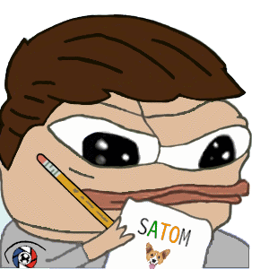
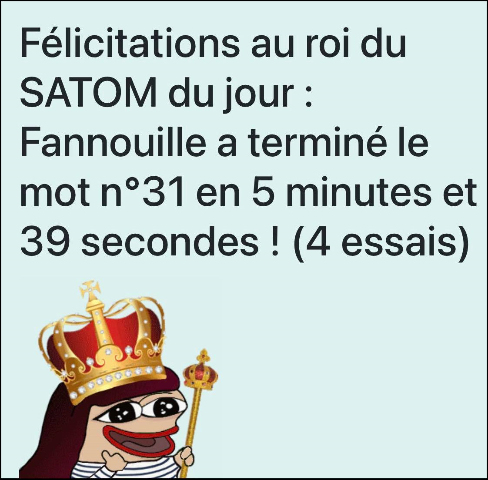

# SATOM

Le SATOM est une adaptation personnelle du [SUTOM](https://sutom.nocle.fr/), lui même une adaptation du jeu télévisé [MOTUS](https://fr.wikipedia.org/wiki/Motus_(jeu_t%C3%A9l%C3%A9vis%C3%A9)).     
L'objectif est de retrouver un mot caché en un nombre limité d'essais. Pour ce faire, le joueur peut proposer successivement différents mots de taille égale,
et le jeu lui indiquera quelles lettres de son mot sont présentes dans le mot caché, et si elles sont bien positionnées.     

Le jeu est entièrement développé à l'aide du framework Python Django et les fonctionnalités sont les suivantes :
- Ajout quotidien d'un mot mystère que les utilisateurs doivent deviner
- Possibilité de deviner les mots des jours précédents via une page dédiée
- Possibilté de créer un compte pour enregistrer ses essais précédents et obtenir des statistiques (nombre de coups moyens, temps passé par mot en moyenne)
- Classement des utilisateurs selon leur score moyen (calculé via le nombre de mots résolus, le temps moyen et le nombre de coups moyen)
- Affichage en première page du "Roi du SATOM du jour" avec le nom de l'utilisateur ayant réussi le mot du jour le plus rapidement (et pour certains utilisateurs, une image personnalisée)
- Affichage en version mobile du site web pour les joueurs sur téléphone (grande majorité des utilisateurs)    

**Roi du SATOM du Jour**

**Interface du mot mystère**

Le jeu était à l'origine uniquement déstiné à ma famille proche pour palier au manque de mots présents sur le SUTOM, mais j'ai pris beaucoup de plaisir à le développer 
et ajouter de nouvelles fonctionnalités, avant de le partager à des utilisateurs supplémentaires
